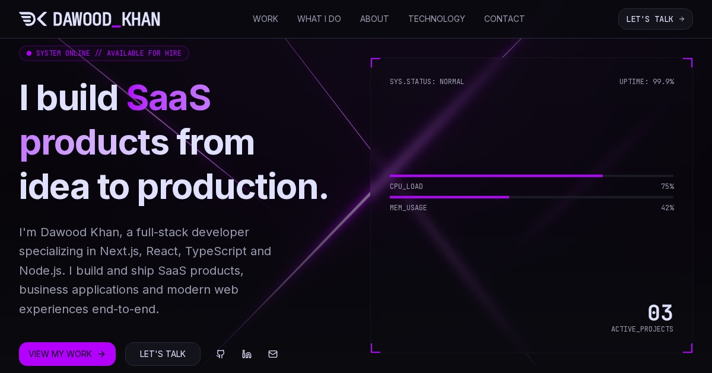

# Dawood Khan — Portfolio

Personal portfolio site for Dawood Khan, full-stack SaaS developer. Built
with [Next.js](https://nextjs.org) and [shadcn/ui](https://ui.shadcn.com),
based on the [Devstarter](https://zippystarter.com/templates/devstarter)
template from [Zippystarter](https://zippystarter.com), customized with the
"Neon Dreams" theme, real project content, and a personalized homepage.



## Getting Started

Install the dependencies. This project uses `pnpm`; if you want to use `npm`
instead, just replace `pnpm` with `npm`.

```bash
pnpm install
```

Then, start the development server:

```bash
pnpm dev
```

Open [http://localhost:3000](http://localhost:3000) with your browser to see the result.

## Tech Stack

- [Next.js](https://nextjs.org/docs) — React framework
- [React](https://react.dev) & [TypeScript](https://www.typescriptlang.org)
- [Tailwind CSS](https://tailwindcss.com) — utility-first styling
- [shadcn/ui](https://ui.shadcn.com) — component primitives and theming
- [lucide-react](https://lucide.dev) — icons

## Notes

This project makes use of modern CSS features such as CSS Grid & Subgrid,
`mix-blend-mode`, and `mask-image`, and follows shadcn's CSS-variable-based
theming system (OKLCH color tokens in `app/globals.css`).
